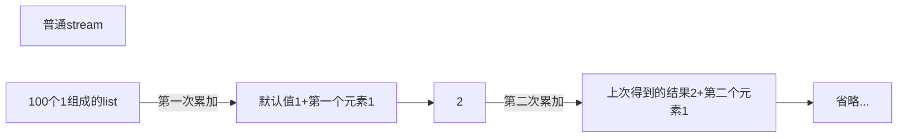
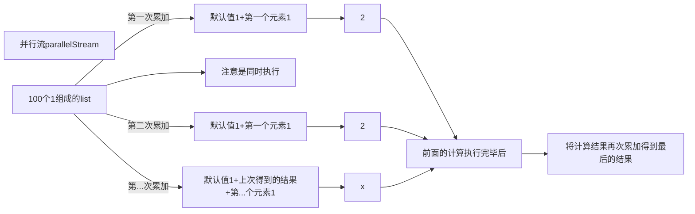

> 人生要有意义只有发扬生命，快乐就是发扬生命的最好方法。——张闻天

关于`reduce`我已经写过[博客](https://VampireAchao.github.io/2021/03/01/reduce%E8%A1%A5%E5%85%85/)了

今天最后再来聊一聊它的第三个重载


之前一直用得少，所以没有去探究它的妙用

最近稍微抽空看了下

发现还挺有意思的

例如它的第三个参数

在[并行流](https://VampireAchao.github.io/2021/06/12/parallelStream/)的场景下同样的代码竟有不同的效果

如下：

```java
    public static void main(String[] args) {
        sum();
        parallelSum();
    }

    private static void sum() {
        List<Integer> list = Stream.generate(() -> 1).limit(100).collect(Collectors.toList());
        System.out.println(list);
        int sum = list.stream().reduce(1, Integer::sum, (a, b) -> {
            System.out.println("stream执行sum时上次结果：[" + a + "]本次值：[" + b + "]");
            return Integer.sum(a, b);
        });
        System.out.println(sum);
    }

    private static void parallelSum() {
        List<Integer> list = Stream.generate(() -> 1).limit(100).collect(Collectors.toList());
        System.out.println(list);
        int sum = list.parallelStream().reduce(1, Integer::sum, (a, b) -> {
            System.out.println("parallelStream执行sum时上次结果：[" + a + "]本次值：[" + b + "]");
            return Integer.sum(a, b);
        });
        System.out.println(sum);
    }
```

仅仅是把`stream`换成了`parallelStream`，得到的结果就不一样了


并且可以通过日志看出，上方第一个`stream`是没有执行我们第三个参数`BinaryOperator<U> combiner`的


而我们下面的`parallelStream`却执行了


并且两者返回的值不一样

第一个返回`101`

是因为我们调用`reduce`时

给了个默认值为`1`

再加上我们聚合计算得到的结果为`100`相加得到`101`

注意这里我们第三个参数`BinaryOperator<U> combiner`并没有执行，于是忽略

就像`(((默认值1+第一个元素1)+第二个元素1)+第三个元素1)+...`这样一直累加，得到结果`101`




第二个返回了`164`

是因为我们调用`reduce`时

给了个默认值为`1`

而我们在并行流计算时，每次计算都会去重复计算一遍这个默认值

就像`(默认值1+第一个元素1)+(默认值1+第二个元素1)+(默认值1+第三个元素1)...`这样

但要注意，并行流的内部使用了默认的 `ForkJoinPool`分支/合并框架，它的默认线程数量就是你的处理器数量

我这里最大线程数为`64`，因此最多我们的默认值会被多加`63`次，得到结果`164`，要注意，可能我的最大线程数并没有这么多，一些线程可能会被重复使用，因此累加次数可能是大于最大线程数

它像一个`BUG`，一个坑，所以要多多注意，这里我们可以避免这个坑的话，初始值我们给`0`即可，因为`0`无论是加一次还是`63`次都不会影响我们最终的结果~




